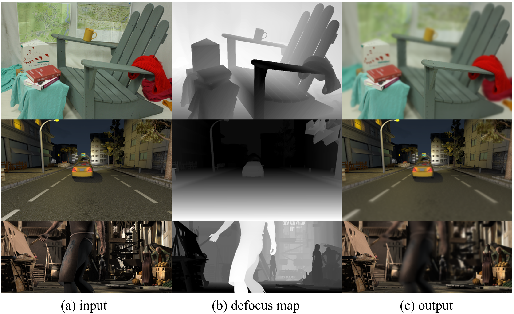

## SYNDOF (Synthetic Defocus Blur Image Dataset)



**Picture:** *Outputs generated from our code&ndash; from left to right, synthetic input, defocus map output and defocused image.*

This repository contains the official matlab implementation of SYNDOF generation used in the following paper:

> **Deep Defocus Map Estimation using Domain Adaptation, CVPR2019**<br>
> Junyong Lee (POSTECH), Sungkil Lee (Sungkyunkwan University), Sunghyun Cho (POSTECH) Seungyong Lee (POSTECH)
> 
> http://cg.postech.ac.kr/papers/2019_CVPR_JY.pdf

For any inquiries, please contact [junyonglee@postech.ac.kr](mailto:junyonglee@postech.ac.kr)

## Resources

All material related to our paper is available via the following links:

| Link |
| :-------------- |
| [Synthetic Datasets](https://www.dropbox.com/s/bymkyss5rtn6avl/synthetic_datasets.zip?dl=0)|
| [Paper PDF](https://drive.google.com/open?id=1wmauOTscwrVs38NR2JfO4Xopt3isqiWT)|
| [Paper Repository](https://github.com/codeslake/DMENet)|

## Preparing Dataset
- Download the synthetic datasets and place it under `./data` (file structure should be `./data/synthetic_datasets`).

## Getting Started
On matlab console, type
```bash
# max_coc, input_offset, output_offset, is_random_gen, is_gpu, gpu_num
generate_blur_by_depth(29, 'data', 'out', false, true, 1)
```

check the results under `./out`, which is structured as,

    .
    ├── ...
    ├── out
    │  ├── blur_map/                    # directory for output defocus map
    │  ├── blur_map_binary/             # directory for binarized defocus map
    │  ├── blur_map_norm/               # directory for normalized defocus map
    │  ├── depth_decomposed/            # directory for decomposed depth
    │  ├── image/                       # directory for input image (with its modified name)
    └── ...

## Reading Defocus Map
We rounded real values of defocus map into the nearest 10th. When you read a defocus map, for example in python, read a file as follows,
```bash
image = (np.float32(cv2.imread(file_name, cv2.IMREAD_UNCHANGED))/10.)[:, :, 1]
image = image / 7. # 7 = (maxCoC - 1) / 4, where maxCoC is 29 in this case.
```

## BIBTEX
If you find this code useful, please consider citing:

```
@InProceedings{Lee_2019_CVPR,
author = {Lee, Junyong and Lee, Sungkil and Cho, Sunghyun and Lee, Seungyong},
title = {Deep Defocus Map Estimation Using Domain Adaptation},
booktitle = {The IEEE Conference on Computer Vision and Pattern Recognition (CVPR)},
month = {June},
year = {2019}
}
```

## License ##
This software is being made available under the terms in the [LICENSE](LICENSE) file.

Any exemptions to these terms require a license from the Pohang University of Science and Technology.

## About Coupe Project ##
Project ‘COUPE’ aims to develop software that evaluates and improves the quality of images and videos based on big visual data. To achieve the goal, we extract sharpness, color, composition features from images and develop technologies for restoring and improving by using them. In addition, personalization technology through user reference analysis is under study.  
    
Please checkout other Coupe repositories in our [Posgraph](https://github.com/posgraph) github organization.

## Useful Links ##
* [Coupe Library](http://coupe.postech.ac.kr/)
* [POSTECH CG Lab.](http://cg.postech.ac.kr/)
